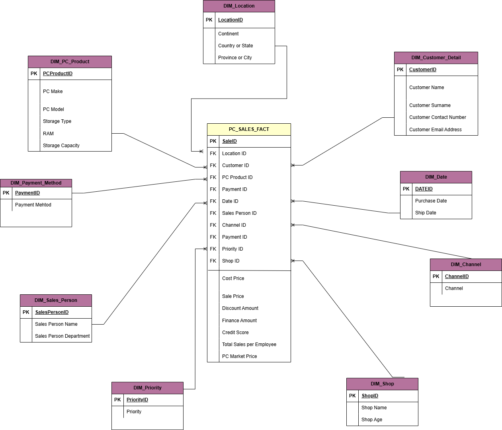
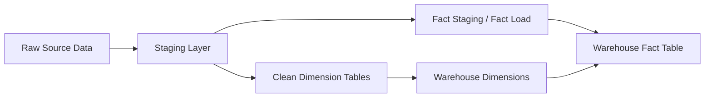
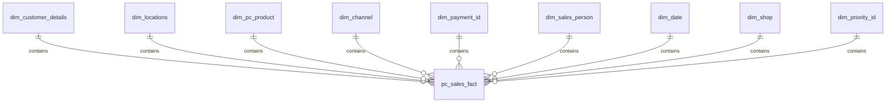
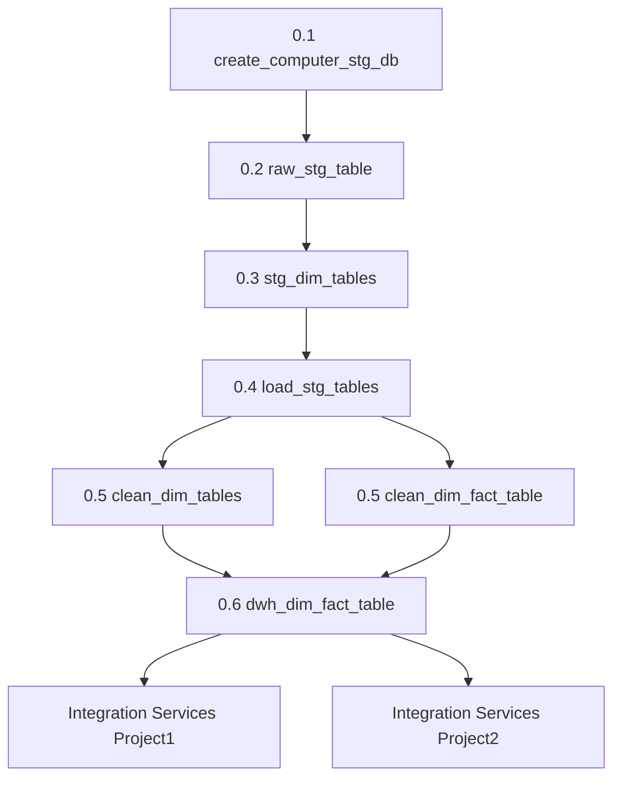

# Computer Sales Data Warehouse Project

## Overview

This repository contains a SQL Server and SSIS-based ETL solution for computer sales data. The project moves data from a raw source into a structured dimensional model that can be used for reporting, business analysis, and decision-making.

## Why this architecture was created

The design follows a layered data warehouse approach so that:

- raw source data is preserved and isolated from transformation logic
- staging tables support data quality checks and intermediate processing
- cleaned dimensions and a fact table provide a consistent analytics model
- reporting can be performed on reliable, business-friendly tables instead of raw operational data

## Visual architecture

## Core tables in the model

| Table | Type | Purpose |
|---|---|---|
| dim_locations | Dimension | Stores continent, country, and city information |
| dim_shop | Dimension | Stores shop-related attributes |
| dim_pc_product | Dimension | Stores PC product and technical specifications |
| dim_sales_person | Dimension | Stores sales representative information |
| dim_payment_id | Dimension | Stores payment method categories |
| dim_priority_id | Dimension | Stores sales priority information |
| dim_date | Dimension | Stores calendar/date attributes |
| dim_channel | Dimension | Stores sales channel information |
| dim_customer_details | Dimension | Stores customer profile details |
| pc_sales_fact | Fact | Stores sales transactions and measures |

## ERD-style overview

The warehouse model is organized around a central fact table connected to multiple dimensions:

- pc_sales_fact is the transactional center of the model.
- Each sales row is linked to a customer, location, product, channel, payment method, salesperson, date, shop, and priority.
- This structure makes it suitable for reporting by product, region, sales person, payment type, and time.

## How this project works

1. Raw computer sales data is loaded into the staging layer.
2. The staging tables are created to preserve the source structure before transformation.
3. Dimension tables are loaded with cleaned and standardized values.
4. The fact table is populated using joins between the cleaned dimensions and the source data.
5. Duplicate records are avoided by using logic such as NOT EXISTS during the load process.
6. The final warehouse tables are ready for analytics, reporting, and dashboarding.

## Project structure diagram

### 0.1 create_computer_stg_db
Creates the staging database used to hold intermediate ETL data.

### 0.2 raw_stg_table
Creates the raw staging table for the source computer sales records.

### 0.3 stg_dim_tables
Creates the staging dimension tables and staging fact structures.

### 0.4 load_stg_tables
Loads source data into the staging tables and prepares it for transformation.

### 0.5 clean_dim_tables and 0.5 clean_dim_fact_table
Transforms and cleans the data into final dimension and fact table structures.

### 0.6 dwh_dim_fact_table
Builds the final warehouse dimension and fact tables used for analytics.

## SSIS integration

The repository also includes SSIS projects for automating the ETL workflow:

- Integration Services Project1
- Integration Services Project2

These packages support creation of tables and loading of data in a repeatable way.

### SSIS package flow screenshot section

If you want to add a visual screenshot of the SSIS package flow later, place the image in the repository and add a section like this:

## How to run the project

1. Open the SQL scripts in SQL Server Management Studio.
2. Run the scripts in this order:
   - 0.1 create_computer_stg_db/create_stg_database.sql
   - 0.2 raw_stg_table/raw_stg_table.sql
   - 0.3 stg_dim_tables/
   - 0.4 load_stg_tables/
   - 0.5 clean_dim_tables/ and 0.5 clean_dim_fact_table/
   - 0.6 dwh_dim_fact_table/
3. Open the SSIS projects in Visual Studio/SSDT to execute or deploy the packages.

## Notes

- The staging database uses stg_computer_sales.
- The cleaned and warehouse layer uses the data warehouse model for analytics.
- The project is designed to be extended with additional dimensions, measures, or automation.

